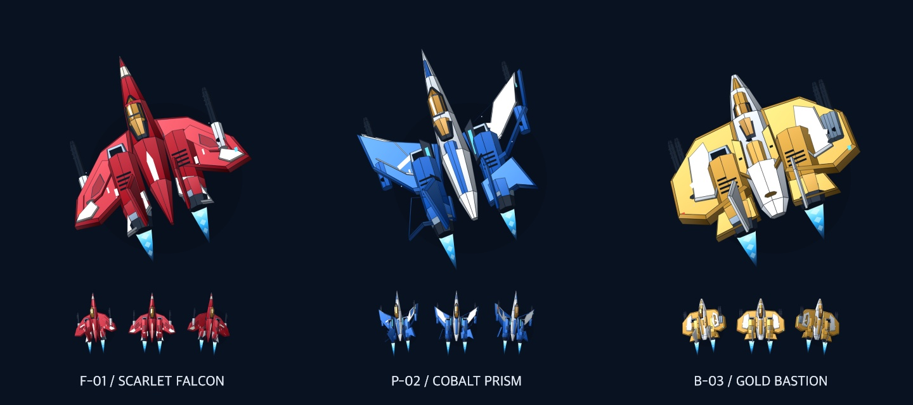

# 雷霆战机 · 天穹远征 / THUNDERFALL

一款原创的纵向弹幕射击游戏：驾驶三种战机穿越五大空域，在漂移弹与激光之间寻找航路，拾取四色武器，并用关间强化组成自己的战斗配置。支持手机触控、鼠标和键盘。

**[立即出击 · 在线试玩](https://thunderfall.vercel.app/)**


- 创作者：[jackroc](https://github.com/jackroc)
- 创作日期：2026-09-08
- 模型参与：用户在创作对话中声明使用 **GPT-6 Astra ultra**；这是经过多轮实现、调试与协作审阅的作品，**不是 one-shot 测试**。
- 技术：原生 JavaScript、Canvas 2D、Web Audio。画面由程序绘制，声音实时合成，没有外部素材、图片生成资产或第三方运行依赖。
- 免费，无需登录或 API Key；最高分和偏好仅保存在当前浏览器。

## 战机造型

三架主机以经典街机《雷电》的机械战机为视觉参考，重做为红白后掠翼的鹰隼、蓝银前掠翼的棱镜和金色重装堡垒。分层装甲、金色座舱、进气口、炮管、垂直尾翼与双引擎来自程序生成的三维网格；机库可以看到倾斜检视角度，实战随移动侧倾，爆发时推进尾焰增强，升级后出现僚机。



模型由 [airframes.js](airframes.js) 建立并投影到 Canvas 2D；实战缓存每架机体的九个转向姿态，兼容不支持 OffscreenCanvas 的浏览器直接绘制。几何和材质为原创实现，没有载入商业模型或贴图。机翼和装甲的视觉范围仍然大于实际受击核心。

## 玩法

开局选择战机：**鹰隼**速度快且均衡，**棱镜**以较轻机体换取更高伤害并自带激光，**堡垒**拥有更厚机体、护盾和额外炸弹。全程自动开火，玩家专注移动、补给路线与技能时机。

| 武器 | 颜色 / 标识 | 特点 |
| --- | --- | --- |
| 风暴脉冲 | 蓝色 P | 扇形散射，覆盖分散敌机 |
| 翡翠光束 | 绿色 L | 穿透前后目标 |
| 紫电追猎 | 紫色 A | 转向追踪敌机 |
| 日冕新星 | 金色 N | 爆裂产生范围伤害 |

击杀敌机有概率掉落武器，运输机与连续未掉落保底也会提供补给。补给在屏幕内漂移反弹，约 **10 秒有效战斗时间**后消失。同款拾取升级，最高 Lv.5；换装其他武器保留各自等级。另有机体修复、护盾和炸弹补给。

敌人包含斥候、左右交替进攻的拦截机、炮艇、激光机、运输机与布雷单位。弹幕包括瞄准弹、弯曲漂移弹、旋转弹阵、加速弹和分裂弹；激光先预警再造成伤害，第四关首领还会扫动光束。

战机中心的小光点是受击核心。贴近子弹可以擦弹得分并充能；连续击杀增加连击分数，最高 ×5。**震荡炸弹**清除敌弹和激光、伤害敌机并提供短暂无敌；充能满后可启动 **8 秒雷霆爆发**，强化火力并在启动时清弹。爆发期间新出现的弹幕仍需躲避。

## 五关战役与成长

航线依次经过 **晨曦海港 → 翡翠峡谷 → 冰川阵列 → 熔核工厂 → 天穹核心**。

每关至少战斗 **120 秒**，第 **88 秒**出现首领。首领入场有 2 秒保护，机体到达 65% 和 30% 时各触发 1.15 秒阶段屏障，无法用单次爆发跳过阶段。首领被击败后继续奖励波，并至少保留 **10 秒补给拾取时间**；满 120 秒且完成拾取窗口后才进入结算。超过 120 秒仍未击败首领，则继续战斗直到击败，再完成拾取窗口。

完整通关至少包含 **600 秒，即 10 分钟有效战斗**；选机、暂停、关间选择和结果画面不计时。较慢的首领战或续战会延长总时长。

前四关结束后，从三张强化卡中选择一张。强化包含伤害、射速、装甲、护盾、补给吸附范围、僚机、炸弹与充能。另附固定过关补给：修复 2 点机体、补满护盾、增加 1 枚炸弹；卡片收益再单独叠加。僚机最多两架，炸弹最多五枚。

**标准模式**在机体剩余 1 点、护盾耗尽且有炸弹时自动触发炸弹保护；**街机模式**提高弹速和首领耐久，需要手动使用炸弹。还可以选择任意一关单独演练，演练不会计入完整战役最高分。

战机被击毁后最多续战三次：重开当前关、保留强化、分数扣除 35%，已用战斗时间保留。持续避弹 13 秒开始恢复护盾，之后仍需继续保持安全才能恢复更多。

## 操作

| 操作 | 电脑 | 手机 |
| --- | --- | --- |
| 移动 | WASD、方向键，或在战场拖动鼠标 | 在战场任意位置按住拖动 |
| 精密低速 | 按住 Shift，或点击「精密移动」 | 点击「精密移动」切换 |
| 震荡炸弹 | 空格，或点击按钮 | 点击「震荡炸弹」 |
| 雷霆爆发 | E，或点击按钮 | 满充能后点击「雷霆爆发」 |
| 暂停 / 恢复 | P、Esc 或界面按钮 | 暂停按钮与「继续战斗」 |

拖动采用相对位移，按下时飞机不会瞬移到手指位置。移动手指与底部按钮分离，可使用另一根手指发动技能。切到后台或窗口失焦会自动暂停，补给寿命、弹幕和技能时钟一起冻结，回到页面后主动继续。

顶部可切换声音并打开玩法说明；界面也提供减少装饰动态的选项。声音由用户交互后启动的 Web Audio 合成，关闭声音不影响玩法。

## 本地运行与构建

此作品使用 ES Modules，应通过 HTTP 访问。直接双击 `index.html` 的 `file://` 方式可能被浏览器模块安全规则阻止。

在仓库根目录运行：

```sh
python3 -m http.server 4173 --directory works/thunderfall
```

打开 [本地游戏](http://localhost:4173)。若希望手机在同一局域网试玩，可使用电脑的局域网 IP 和相同端口访问；是否能够连接取决于本机网络与防火墙设置。

构建和单元测试只使用 Node.js 自带模块，不需要安装第三方包：

```sh
cd works/thunderfall
npm test
npm run build
```

`build.mjs` 将九个运行文件复制到 `dist/`。构建结果是静态站点，可用任意支持 JavaScript 模块的静态托管服务发布。

## Vercel 部署

为本作创建独立的 Vercel 项目 **thunderfall**，与其他作品或个人网站分别管理。连接此仓库时使用以下配置：

| 配置 | 值 |
| --- | --- |
| Root Directory | `works/thunderfall` |
| Framework Preset | Other |
| Build Command | `npm run build` |
| Output Directory | `dist` |
| 环境变量 | 无需配置 |

生产入口：[thunderfall.vercel.app](https://thunderfall.vercel.app/)。首次发布使用 Vercel CLI；后续从作品目录运行 `vercel --prod` 即可更新。上述配置也适用于通过 Git 导入项目。

## 验证记录与边界

2026-09-08 的开发验证包括：

- **27 项引擎单元测试通过**：涵盖三种战机、四色武器、10 秒补给与边界反弹、暂停冻结、激光预警、漂移轨迹、扫掠碰撞、升级与续战限制，以及首领入场、阶段屏障与击破后的完整拾取窗口。
- 以固定帧步长推进真实引擎，验证五个首领依次经过三个阶段后才能通关，完整战役有效战斗时间不低于 600 秒。
- **六次自动驾驶模拟自然通关**，有效战斗时间约 **635–730 秒（10 分 35 秒至 12 分 10 秒）**。这类模拟用于检查流程与基础平衡，不代表真人操作难度评估。
- 浏览器中验证了选择战机、拖动移动、自动开火、拾取换装、炸弹、暂停与单关结果；检查了 390 × 844、375 × 667 竖屏和 667 × 375 横屏布局。
- Vercel 生产入口与九个运行文件均可匿名访问，内容与发布源文件一致。

这些结果不等于十分钟真人浏览器通关，也不是实物手机测试。触控体验与不同手机上的性能仍需以真实设备试玩结果为准。

## 创作与许可

实际用户请求与整理后的复用规格见 [PROMPT.md](PROMPT.md)，关卡和机制设计见 [DESIGN.md](DESIGN.md)，结构化信息见 [metadata.json](metadata.json)。协作代理参与了程序画面、关卡设计、引擎测试与审阅；实现经过迭代，不以一次提示生成结果作为评测结论。

本项目原创代码、程序画面与合成声音按仓库的 [CC0-1.0 许可](../../LICENSE) 提供。机制研究参考了 [MOSS《雷电 IV》官方介绍](https://raiden.mossjp.co.jp/ps3/about.html) 与 [CAVE《怒首领蜂最大往生》系统说明](https://www.cave.co.jp/gameonline/saidaioujou/system/dress/)；没有使用其代码、角色、美术或音频，与相关商业作品及厂商无关联。
